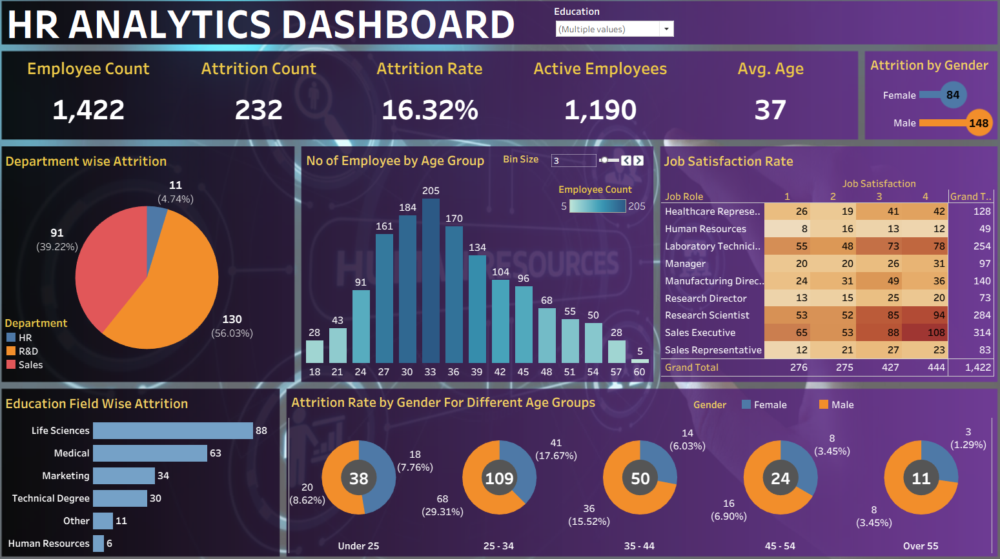

# HR Analytics Dashboard (Tableau)

This repository contains an interactive **HR Analytics Dashboard** built using **Tableau**. The dashboard provides insights into employee attrition, job satisfaction, age demographics, and departmental trends—enabling effective, data-driven HR decisions.

---

## 🔍 Features

- **Overall Metrics**: Employee count, attrition rate, average age.
- **Attrition Breakdown**:
  - By department, gender, age group, and education field.
- **Employee Demographics**:
  - Age distribution with binning.
  - Gender-wise attrition across age groups.
- **Job Satisfaction**:
  - Role-wise satisfaction scores (scale 1–4) in matrix format.

---

## 📁 Files Included

- `HR Data.xlsx` – Dataset used for building the dashboard.
- `HR_Analytics.png` – Preview image of the Tableau dashboard.
- `HR Analytics Dashboard.twb` - Tableau file which contains the visualizations

---

## 🛠 Tools Used

- **Tableau Desktop** – For data visualization and dashboard development.
- **Microsoft Excel** – For dataset formatting and cleaning.

---

## 📈 Key Insights

- Sales department shows the highest attrition (56%).
- Most attrition occurs in the 25–34 age group.
- Male employees contribute more to attrition than females.
- Research Scientist and Sales Executive roles score high in job satisfaction.

---
